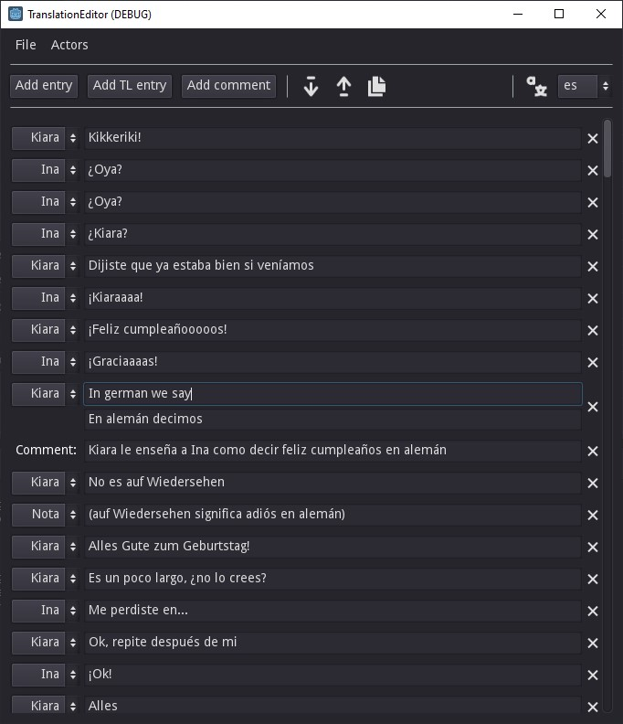

# Translation editor
### Made in Godot

Small translation editor, it exports to a .txt file for it to be later used in programs like Aegisub.

This tool DOES NOT generate the subtitle files, nor is is useful for timing the subtitles. It's only used to transcribe and translate the lines from a video.

## Interface
You can add lines to the transcript and choose which actor is talking which lines. You can also add comments which in some programs can be used to separate different scenes.



## Export
This is an example of how an exported .txt file looks. The first line is used to store the actors in the file, this is used to load the file and can be ignored.
```
#Ina,Kiara,Calli,Nota
Kiara: Kikkeriki!
Ina: ¿Oya?
Ina: ¿Oya?
Ina: ¿Kiara?
Kiara: Dijiste que ya estaba bien si veníamos
...
```

## The tool in action

As you can see, it can be used with a video watching program. The tool will always stay on top so it's easy to use over a video.

## Todo:
- Make an interface to manage the actors in the scene (right now you can load a file with the actors like in the export example)
  - Ability to change an actors color
- Make save function, right now when saving it always is like save as
- Remember the last path you loaded or exported to
- Spell check
- Maybe in the future make a special kind of entry, where you type the line in the original language and it gives you the translation on the other side, this via google translate or DeepL